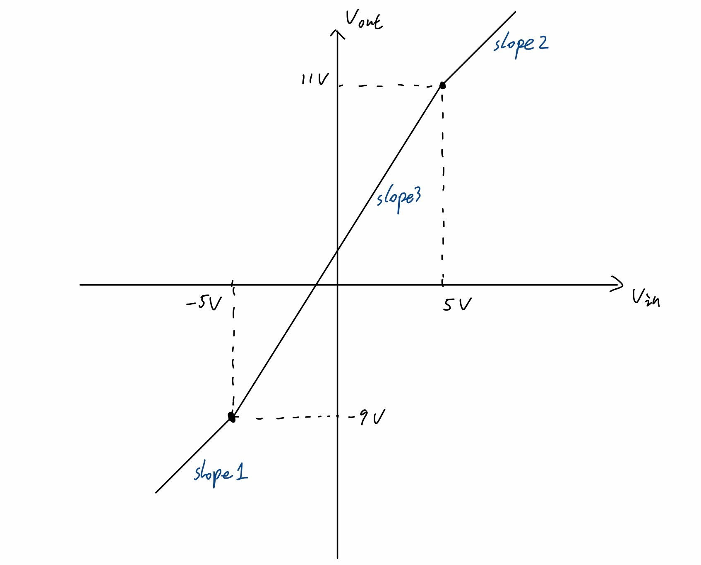
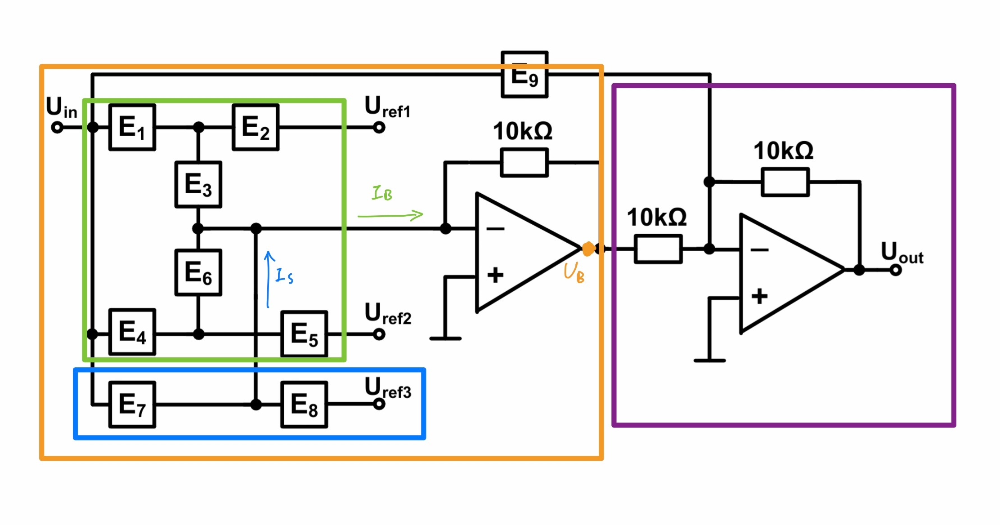
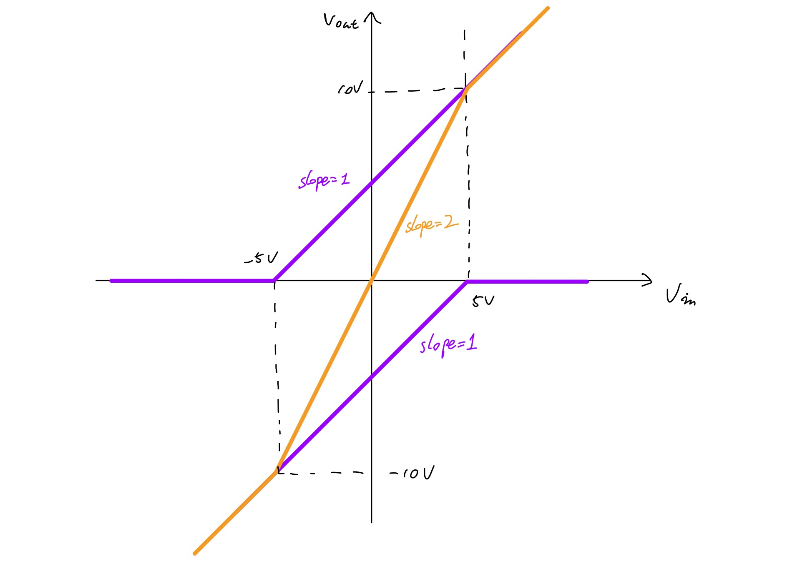
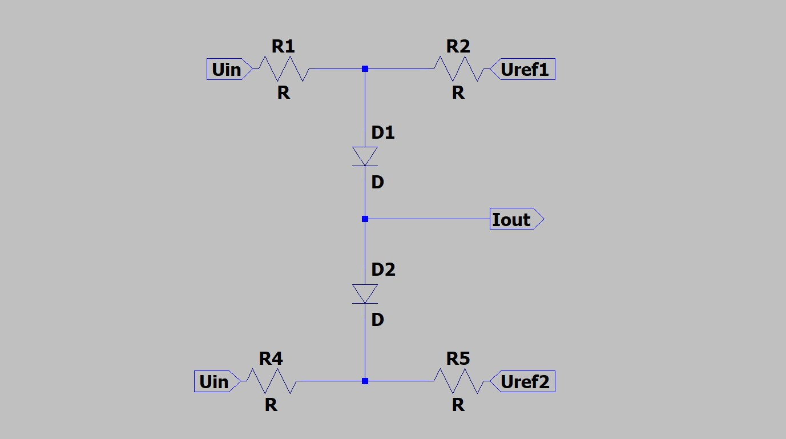
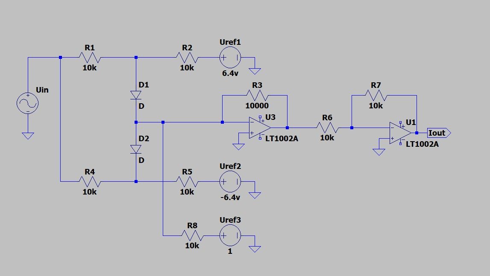
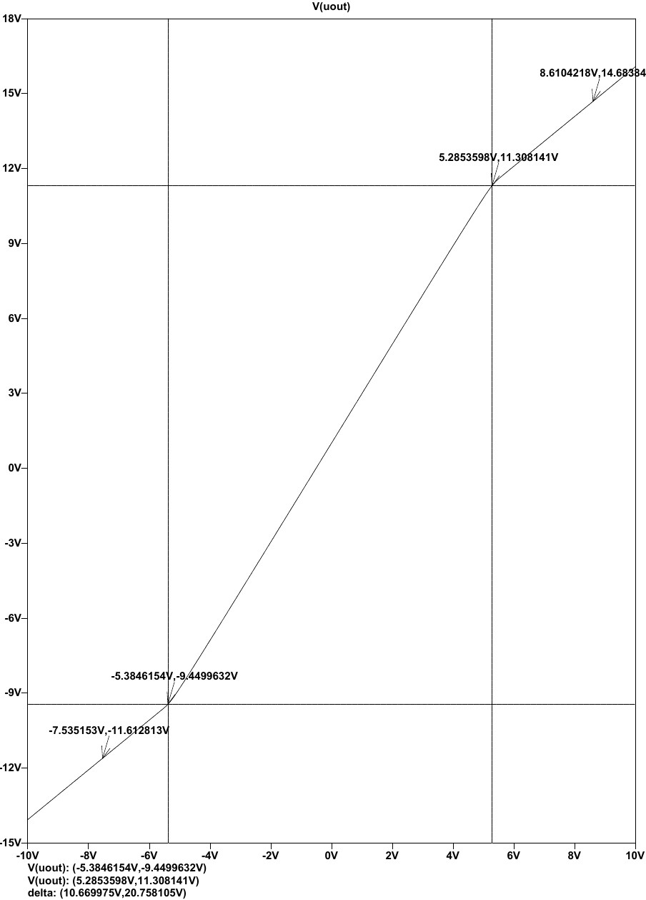

# Electronics 2 homework
> Name: Qianhao Zhang  
> Neptun: CP4IRF

Design a break point circuit given by following parameters.

| Reference voltage| Break points | Slope |
|---|---|---|
| $U_{ref1} = 6.4V$ | $U_{inBrk1} = -5V$ | $Slope_1 = 1$
| $U_{ref2} = -6.4V$ | $U_{inBrk2} = 5V$ | $Slope_2 = 1$
| $U_{ref3} = 1V$ | $U_{outBrk1} = -9V$ | 
| | $U_{outBrk2} = 11V$ | 

## Graph
With there parameter we are able to plot a graph of input and output voltage.

## My approch

### 1. Analyize the graph
We can notice that if we shift the graph by 1 unit down. $U_{outBrk1}$ becomes 10V and $U_{outBrk2}$ becomes -10V. We can then obtain a perface symmetrical graph.

There are two break points with the same slop beforw the fiest breakpoint and after the second breakpoint. We can also calculate the slope between breakpoints as:
$$
Slope_3 = \frac{11-(-9)}{5-(-5)} = 2
$$

This happens to be double of slope 1 and 2.

### 2. Analyize the circuit
We can seperate the circuit to three parts:

#### Part1(Purple)
This is a inverting amplifier which invert the voltage output. Graphically the graph will be "fliped" along the horizontal axis.

#### Part2(Orange)
This is a breakpoint circuit it self. The voltage $U_B$ depends on current $I_B$
$$ U_B = - 10k\Omega * I_B \tag{1}$$ 

#### Part3(Green)
The two 3-pole circuit we need to generate two break points.

#### Part4(Blue)
This is not a three pole. But we can shift the graph by supplying a current $I_s$ here.

### 3. Circuit design
First we assume E9 is open circuit. In which case part1 invert the voltage. 

$$U_{out} = - U_B$$

Because of equation 1 and inverting amplifier we need to shift the voltage graph at $U_B$ **up** by 1V. This is done by $I_s$

$$ I_s = \frac{1V}{-10k\Omega} = 0.1 mA \tag{2} $$

Now we need to design a break point circuit to match a symmetrical graph. We can see that by adding the two function marked by purple we can get the desired characteristic. The two function have turning points at 5V and -5V. And same slope befor or after the turning point.

To achive this characteristic we pick these two 3-pole circuit.

The upper and lower circuit have a turning point at 
$$ U_{t1} = -\frac{R_1}{R_2}U_{ref1} +\frac{R_1+R_2}{R_2}U_d= -5V $$ 
$$ U_{t2} = -\frac{R_4}{R_5}U_{ref2} -\frac{R_4+R_5}{R_5}U_d= 5V  $$
The slope of two circuits are the same. We are looking for a slope of $-1\frac{V}{V}$ at $U_B$ point. Consider the relation described at equation 1 the slope of $I_B$ should be.
$$ slope_{I_B} = \frac{1}{R_1}= \frac{1}{R_4} = \frac{-1}{-10k} = 0.1\frac{mA}{V} $$

Inorder to supply current $I_s$ we can make E7 an open circuit and E8 a resistor $R_8$. This way current will flow from $U_{ref3}$ to virtual ground point through $R_8$. Previously in equation 2 we calculated the current required to shift the graph by 1V. We can then list this equation about $I_s$
$$ I_s = \frac{U_{ref3}}{R_8} = 0.1mA $$

Now we can establish a system of equation
$$
\begin{cases}
        -\frac{R_1}{R_2}6.4V +\frac{R_1+R_2}{R_2}0.7V= -5V \\
        -\frac{R_4}{R_5}(-6.4V) -\frac{R_4+R_5}{R_5}0.7V= 5V \\
        \frac{1}{R_1} = 10^{-4} \\
        \frac{1}{R_4} = 10^{-4} \\
        \frac{1V}{R_8} = 0.1mA
\end{cases}
$$

5 equations and 5 unknowns this is solvable. Results are
$$
{R_1} = {R_2} = {R_4} = {R_5} = {R_8} = 10k\Omega
$$

## Final design 
|Component|Value|Component|Value|
|----|----|----|----|
|E1|10k resistor|E6|diode|
|E2|10k resistor|E7|open circuit|
|E3|diode|E8|10k resistor|
|E4|10k resistor|E9|open circuit|
|E5|10k resistor|

Opreational amplifier supply voltage is hidden from the diagram for the clarity.

## Simulation
Simulation is done using LTspice. LT1002A opreational amplifier is used for this simulation. Also we need to specify the forward voltage of diodes in the diode model to be 0.7V.

As showen in the simulation two break points meets the desired parameter with around 5% error. We can also calculate the slope of graph.

$$
\begin{aligned}
slope_1 = \frac{-9.45+11.61}{-5.38+7.54} = 1 \\ 
slope_2 = \frac{14.68-11.31}{8.61-5.29} = 1.02\\
slope_3 = \frac{11.31+9.45}{5.29+5.37} = 1.95
\end{aligned}
$$

