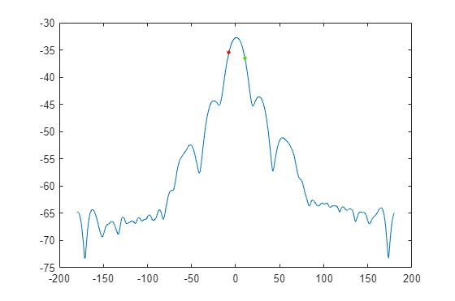

Group: AC
Students:
- Qianhao Zhang
- Srdan Cosic
- Jerome Asante

## Measurement procedure

The measurement is carried out in an anechoic chamber. We measure the radiation pattern by measuring the receiving power while rotating the transmitting antenna. Both antenna is rotated along its main direction 90 degrees to measure both polarization.

## Measurement data

The result is stored in a csv file. The first column is antenna angle in degree, second column is receiving power in dBm.

```csv
-180,-64.76274872000001

-179.278564453125,-64.75461578

-178.5571136474609,-64.82782745

-177.8356781005859,-64.94781494
...,...
```

These data can be easily read in by Matlab using the `readtable` function.

### Data visualization
```matlab
% Get a list of all CSV files in the data folder
file_list = dir('data/*.txt');

% Loop through each file and plot the data
for i = 1:length(file_list)
    % Get the file name and remove the file extension
    file_name = file_list(i).name;
    title_str = strrep(file_name, '.csv', '');
    
    % Read the CSV file into a table
    data = readtable(['data/' file_name], 'HeaderLines', 0);

    % Extract the antenna degree and signal level columns from the table
    antenna_degrees = data{:, 1};
    signal_levels = data{:, 2};

    % Plot the data as a line graph and set the graph title
    plot(antenna_degrees, signal_levels);
    xlabel('Antenna Degree (degrees)');
    ylabel('Signal Level (dBm)');
    title(title_str);

    % Save the plot as a PNG file with the same name as the CSV file
    saveas(gcf, ['plots/' file_name '.png']);
    
    % Add a new figure for each plot
    figure;
end
```


## Estimate antenna directivity from measured data.
We need to find the angle when the receiving power is 3dB lower than the maximum value. To do this we first find the maximum value and search for the point 3dB lower. Because our data is discrete the closest match is returned.

### Horizontal plane



$$\theta_{rihgt} = 10.4609\degree$$
$$\theta_{left} = -7.5752\degree$$
$$\theta = 18.0361\degree$$

### Vertical plane


$$\phi_{right}=9.7395\degree$$
$$\phi_{left}=-9.7395\degree$$
$$\phi = 19.4790\degree$$

### Calculation
Now we have beamwidth of the main lobe. Directivity is given by

$$D \approx 4\pi\frac{\left(\frac{180}{\pi}\right)^2}{\theta\cdot\phi}$$
Substituting our result the directivity is:
$$D = 117.4214$$