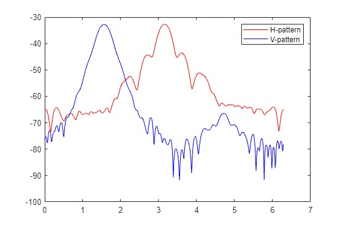
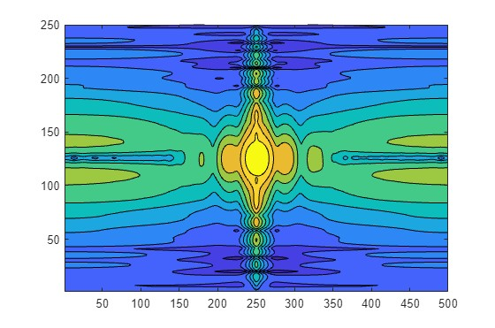
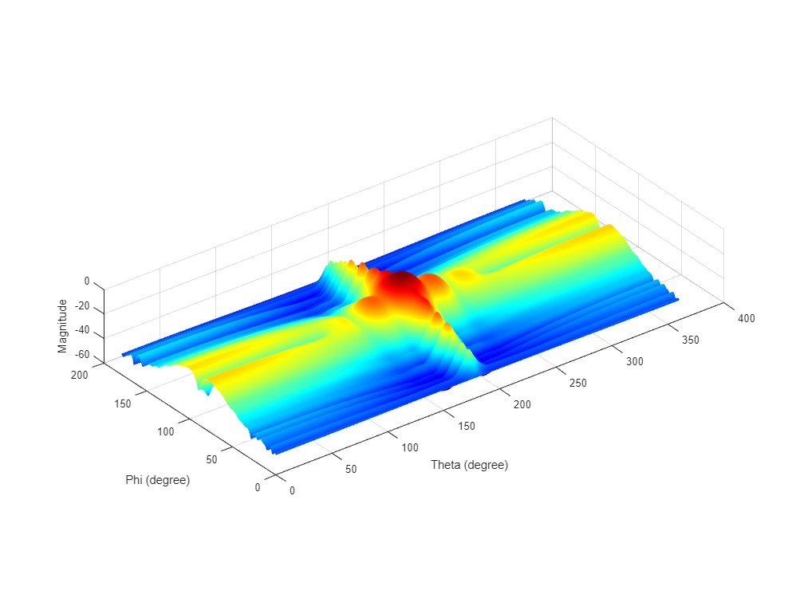
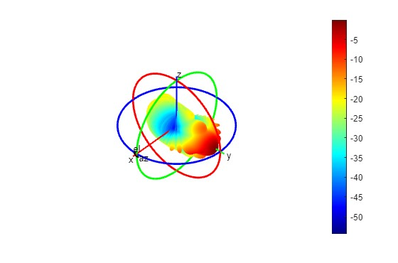

In this report I will estimate the directivity of a horn antenna from its radiation pattern we measured previously. The method used in this report is published by Teodor Petrita and Alimpie Ignea in their [paper](https://ieeexplore.ieee.org/abstract/document/6408150).

## Measurement procedure
The measurement is carried out in an anechoic chamber. We measure the radiation pattern by measuring the receiving power while rotating the transmitting antenna. Both antenna is rotated along its main direction 90 degrees to measure both polarization.

## Measurement data
The result is stored in a csv file. The first column is antenna angle in degree, second column is receiving power in dBm.
```csv
-180,-64.76274872000001

-179.278564453125,-64.75461578

-178.5571136474609,-64.82782745

-177.8356781005859,-64.94781494
...,...
```

These data can be easily read in by Matlab using the `readtable` function.

### Data processing
The first step is to read in the data for both polarity and rename the default column name.
```matlab
% Read data from csv file
data_hh = readtable("data/8 GHz H-H.txt");
data_vv = readtable("data/8 GHz V-V.txt");


% Rename two variables
data_hh = renamevars(data_hh, {'Var1','Var2'}, {'angle', 'power'});
data_vv = renamevars(data_vv, {'Var1','Var2'}, {'angle', 'power'});
```

In our measurement we defined the main direction to be (0,0) degree, the antenna rotate from -180 to 180 degree. However, in the paper the author used a different definition for main direction which is (180,90). To compensate this different, I changed out data. Also convert all angles to radian using `deg2rad` function.
```matlab
% Transform both range to (0,360)
data_hh.angle = data_hh.angle + 180;
data_vv.angle = data_vv.angle + 180;

  
% Transform angles to radian
data_hh.angle = deg2rad(data_hh.angle);
data_vv.angle = deg2rad(data_vv.angle);


% Shift the vertical data so the main direction becomes 90
data_vv_1 = data_vv.power(1:125);
data_vv_2 = data_vv.power(126:end);
data_vv.power = vertcat(data_vv_2, data_vv_1);

% Transform both to linear field pattern
data_hh.power = arrayfun(@log2linear, data_hh.power);
data_vv.power = arrayfun(@log2linear, data_vv.power);

% Normalize power
hh_power_max = max(data_hh.power);
data_hh.power = data_hh.power/hh_power_max;
vv_power_max = max(data_vv.power);
data_vv.power = data_vv.power/vv_power_max;

```

Now to varify my modification I plot both patterns.

Note that the main direction for H polarization is $180\degree$ or $\pi$. And the main direction for V polarization is $90\degree$ or $\frac{\pi}{2}$.

## Estimate 3D pattern
### Slice the V pattern
In the paper authors separated the vertical pattern to two parts, front and back. With the following definition.
$$\begin{split}
VF(\theta) = V(\theta), \theta\in[0..\pi]\\
VR(\theta) = V(\theta+\pi), \theta\in[0..\pi]
\end{split}$$

To achieve this I split the vertical pattern data into two tables. With data from $[0,\pi]$ in `data_vv_front` table and data from $[\pi,2\pi]$ in `data_vv_rear` table. Note that by using the same index for both table the difference between two angle will always be $180\degree$
```matlab
% extract the vertical front data
data_vv_front = table(data_vv.angle(1:250), data_vv.power(1:250), 'VariableNames', {'angle', 'power'});
% extract the vertical rear data
data_vv_rear = table(data_vv.angle(251:end), data_vv.power(251:end), 'VariableNames', {'angle', 'power'});

```

### Calculation
The interpolation formula proposed by the authors is the following.
$$C(\theta,\phi)=\left(\frac{H(\phi)\cdot\sin^2\theta}{VF(\frac{\pi}{2})\cdot\cos^2(\frac{\phi}{2})+VR(\frac{\pi}{2})\cdot\sin^2(\frac{\phi}{2})}+\cos^2\theta\right)\cdot\left(VF(\theta)\cdot\cos^2(\frac{\phi}{2})+VR(\theta)\cdot\sin^2(\frac{\phi}{2})\right)$$
This function is implemented in Matlab as `interpolation` function.
```matlab
function result = interpolation(v_index,h_index, data_hh, data_vv_front, data_vv_rear)
    theta = data_vv_front.angle(v_index);
    phi = data_hh.angle(h_index);
    numerator = data_hh.power(h_index)*sin(theta)^2;
    denomenator = data_vv_front.power(125)*cos(phi/2)^2+data_vv_rear.power(125)*sin(phi/2)^2;
    fun2 = data_vv_front.power(v_index)*cos(phi/2)^2+data_vv_rear.power(v_index)*sin(phi/2)^2;
    result = (numerator/denomenator+cos(theta)^2)*fun2;
end
```

To calculate $C$ for all angles I declared a 250*500 matrix and loop through all angles to collect the result.
```matlab
% create a 250*500 empty matrix
result = zeros(250, 500);


% Loop through all angles to get result
for h_index = 1:500
    for v_index = 1:250
        result(v_index, h_index) = interpolation(v_index, h_index, data_hh, data_vv_front, data_vv_rear);
    end
end
```

## Visualization
The result is then converted to logarithmic scale for visualization. I used three method for plotting. A heat map, 3D plot in both Cartesian coordinate system and spherical coordinate system.




## Directivity calculation
For normalized linear power density function $P(\theta,\phi)$ the directivity in the main direction can be calculated by:
$$D = \frac{4\pi}{\int_{\phi=0}^{\phi=2\pi}\int_{\theta=0}^{\theta=\pi}P(\theta,\phi)\sin\theta\,d\theta\,d\phi}$$

```matlab
for index = 1:250
    result2(index,:) = result2(index,:) * sin(data_vv_front.angle(index));
end

% tranpose the matrix since we need to integrate over theta first
result2 = result2';

P_total2 = trapz(data_hh.angle,trapz(data_vv_front.angle,result2,2))


D = (4*pi)/(P_total2)
```
And the result is:
$$D = 75.6563$$

### Verification 
To verify my solution, I create a radiation pattern measurement data with the same power among all directions, which represent an isotropic antenna. And calculated directivity $D = 1$ as expected.


## Reference
- T. Petrita and A. Ignea, "A new method for interpolation of 3D antenna pattern from 2D plane patterns," _2012 10th International Symposium on Electronics and Telecommunications_, Timisoara, Romania, 2012, pp. 393-396, doi: 10.1109/ISETC.2012.6408150.